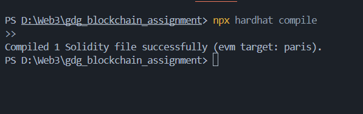
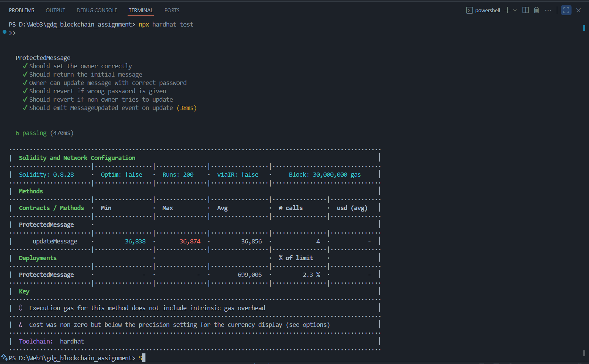
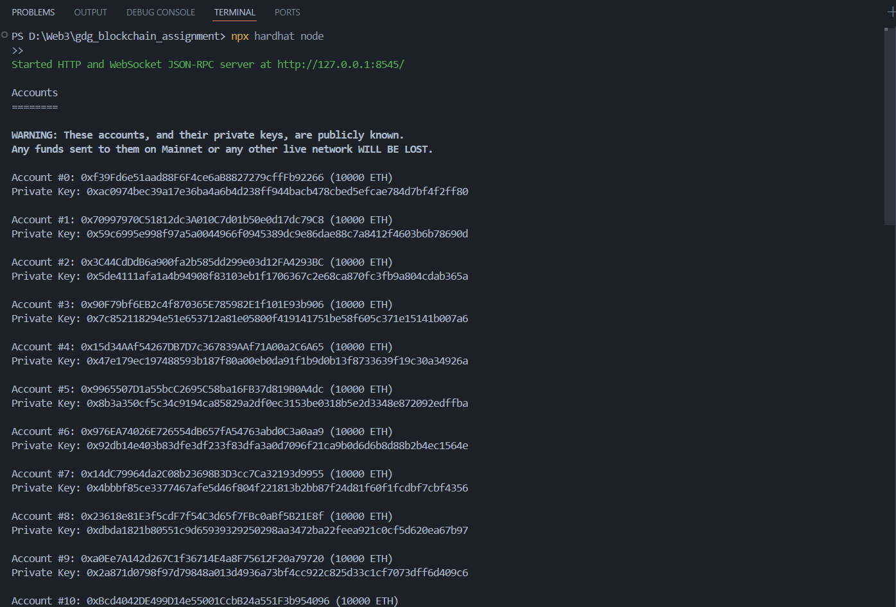
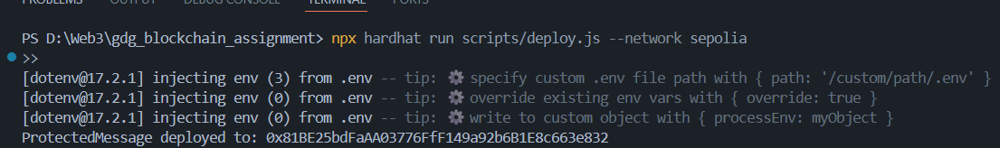
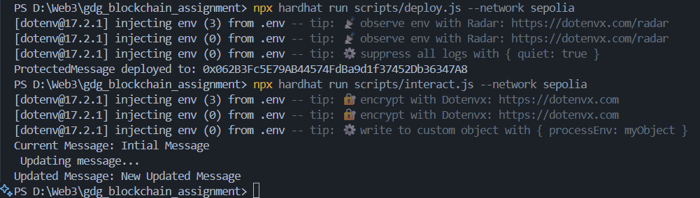

# Sample Hardhat Project
Compiling:

Local Testing:

Creating Local Network:

Deploying and intreacting with Contract in localserver

Deploying in Seploila Testnet

Sepila contract address : 0x81BE25bdFaAA03776FfF149a92b6B1E8c663e832
Deployemnt hash : 0x99e29e79586cde316c8305d4b521504a62b2be6d546fba30b64c0bd938c338d7
https://sepolia.etherscan.io/tx/0x99e29e79586cde316c8305d4b521504a62b2be6d546fba30b64c0bd938c338d7
Changing message hash:0x2538de6a61fbaaa5f757986b275cce5cc47bd35b7e5eb844f308776fe16b2f91
https://sepolia.etherscan.io/tx/0x2538de6a61fbaaa5f757986b275cce5cc47bd35b7e5eb844f308776fe16b2f91

Wallet Address : 0x0CfB00Dc12f550D47A511Bb98B9fAE1D1240dcbA(Fund me )